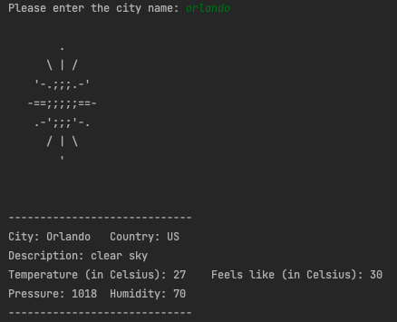

## Terminal Weather

A weather app made for the terminal!

#### Usage:
Simply run the executable from the terminal. You will be asked to input a city name. <br>
Once city name is inputted, basic weather information for that city is outputted! <br>
Weather data is received from [OpenWeatherMap](https://github.com/nlohmann/json)

Example: <br>

------------------------------------------------------------------------------------
#### Dependencies: 
1. [`jpbarrette/curlpp`](https://github.com/jpbarrette/curlpp#readme) (for making the API requests): will need to compile this into a 
static library and link <br> the library.  All files are included in `/lib`. <br>
   2. if you are using CLion, you can use the following in the CMakeLists.txt file: under Configuration -> edit <br>
      configuration -> click okay on the library -> build. See this [CLion tutorial](https://www.jetbrains.com/help/clion/quick-cmake-tutorial.html#link-libs) (Section 8: Linking Libraries).   
      ```cmake
        add_library(_curlpp STATIC lib/cURLpp.cpp lib/Easy.cpp lib/Exception.cpp lib/Form.cpp lib/Info.cpp lib/Multi.cpp lib/OptionBase.cpp lib/Options.cpp lib/internal/CurlHandle.cpp lib/internal/OptionList.cpp lib/internal/OptionSetter.cpp lib/internal/SList.cpp)
        
        include_directories(lib/curlpp)
        include_directories(lib/curlpp/utilspp)
        
        find_library(_CURLPP _curlpp static_lib)
      ``` 
2. [`nlohmann/json`](https://github.com/nlohmann/json): used for parsing the json response from OpenWeatherMap. You will need to download<br>
this library and make sure it is in your include path (this library requires libcurl).


